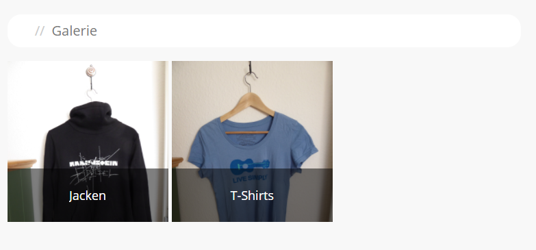
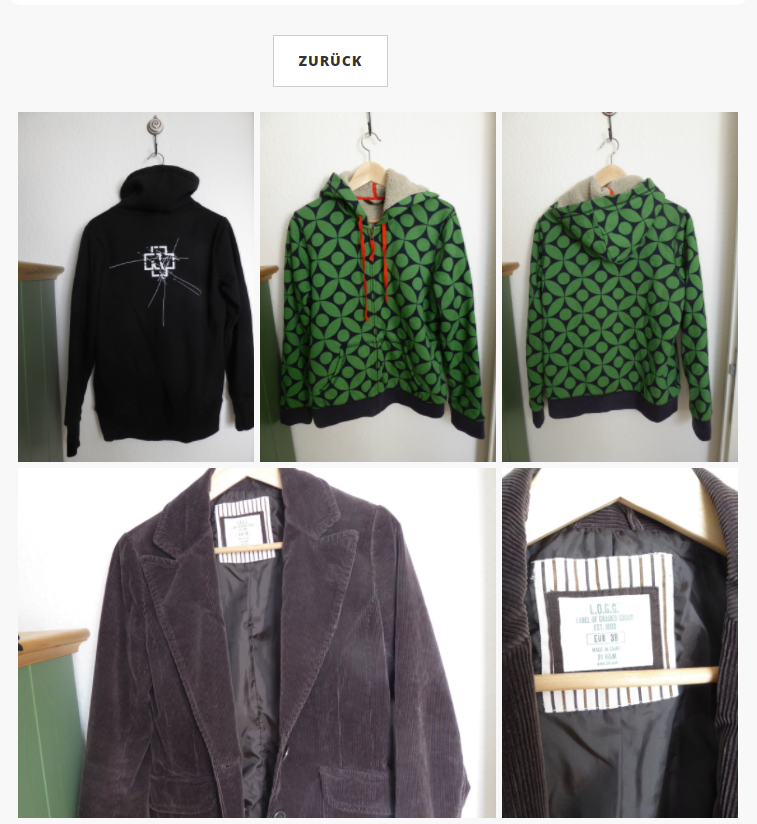
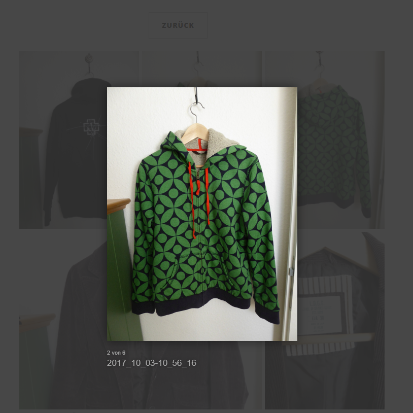
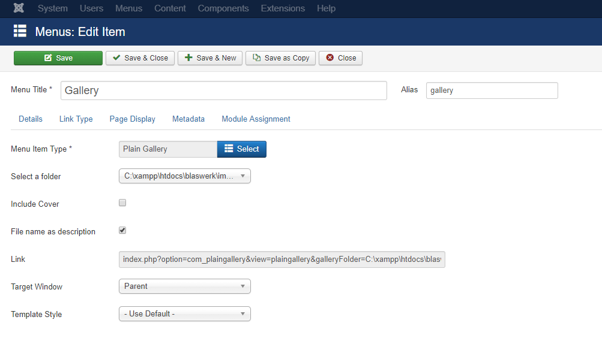

# Plain Gallery

**Probably the simplest gallery Joomla has ever seen.**

Plain Gallery is a Joomla component providing a very simple gallery for your CMS and is based on the [jQuery](https://jquery.com/) as well as [Lightcase](http://cornel.bopp-art.com/lightcase/) and  [Bootstrap](http://getbootstrap.com/). Please be aware that only Lightcase is shipped within this component. Everyting else should be included by your template.

The **idea of the gallery** is to use Joomla's backend media browser for the upload of the images and the creation of subfolders. All that's left for the author is to select a folder from the media repository serving as the base directory for the gallery. The component will look for a file name containing the string **"cover"** in each subdirectory which will be the cover file for that album. If there's none the first image gets picked as cover file.

## Screenshots/Usage

###### Gallery:

###### Album:

###### Image (using Lightcase):

###### Options:

* **Select folder**: The folder serving as the base directory for your gallery from your media browser.
* **Include cover**: Defines whether the album's cover file should also be included in the album itself.
* **File name as description**: Defines whether the file's names should serve as the image description.
